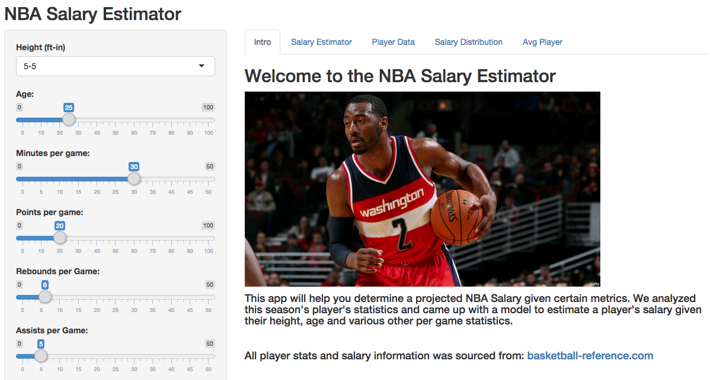

NBA Salary Estimator
========================================================
author: Quang Nguyen
date: 2/22/15
font-import: http://fonts.googleapis.com/css?family=Roboto
font-family: 'Roboto'

NBA Salary Estimator Intro
========================================================

This presentation covers creating an NBA Salary Estimator Tool. This tool has taken in current NBA salary and statistics data and created a model to project NBA Salaries. This quite interesting for several reasons

- It helps determine estimated salary given a set of metrics
- It allows you to have an idea of which players are over/undervalued
- It lets you enter in your own stats and see how much money you would make in the NBA!

Getting Data
========================================================

I got all the NBA data from basketball-reference.com, from here I exported a csv to analyze
<small style="font-size:.5em">

```r
nba.df <- read.csv("nba_stats.csv", header = TRUE)
head(nba.df)
```

```
  Rk        Player Ft In Inches   Salary Salary_M  Season Age  Tm  Lg  G
1  1 Nate Robinson  5  9     69  2106720    2.107 2014-15  30 DEN NBA 33
2  2 Isaiah Thomas  5  9     69  7238606    7.239 2014-15  25 PHO NBA 46
3  3  Shane Larkin  5 11     71  1606080    1.606 2014-15  22 NYK NBA 50
4  4     Ty Lawson  5 11     71 11595506   11.596 2014-15  27 DEN NBA 51
5  5    John Lucas  5 11     71   137382    0.137 2014-15  32 DET NBA  7
6  6  Phil Pressey  5 11     71   816482    0.816 2014-15  23 BOS NBA 33
  GS   MP  FG FGA X2P X2PA X3P X3PA  FT FTA ORB DRB TRB AST STL BLK TOV
1  1  465  71 204  47  112  24   92  26  40  14  25  39  77  14   3  22
2  1 1181 218 512 137  305  81  207 184 211  26  83 109 171  45   5  89
3 14 1106 106 256  79  177  27   79  30  37  17  81  98 126  63   4  48
4 51 1886 300 671 246  521  54  150 207 283  28 135 163 513  65   5 135
5  0   94  16  36  10   23   6   13   0   0   2   2   4  26   3   0   3
6  0  367  37 106  24   61  13   45  18  25   7  36  43  66  20   3  22
   PF PTS   FG.  X2P.  X3P.  eFG.   FT.   TS.  MPG  PPG FGAPG RPG  APG
1  68 192 0.348 0.420 0.261 0.407 0.650 0.433 14.1  5.8   6.2 1.2  2.3
2 105 701 0.426 0.449 0.391 0.505 0.872 0.579 25.7 15.2  11.1 2.4  3.7
3  93 269 0.414 0.446 0.342 0.467 0.811 0.494 22.1  5.4   5.1 2.0  2.5
4  93 861 0.447 0.472 0.360 0.487 0.731 0.541 37.0 16.9  13.2 3.2 10.1
5   8  38 0.444 0.435 0.462 0.528    NA 0.528 13.4  5.4   5.1 0.6  3.7
6  34 105 0.349 0.393 0.289 0.410 0.720 0.449 11.1  3.2   3.2 1.3  2.0
  STLPG BPG
1   0.4 0.1
2   1.0 0.1
3   1.3 0.1
4   1.3 0.1
5   0.4 0.0
6   0.6 0.1
```
</small>
Running a Model
========================================================

After trying a number of models, I settled on one that I thought was taking in the most interesting and relevant variables, this is seen below.
<small style="font-size:.8em">

```

Call:
lm(formula = Salary_M ~ Inches + Age + MPG + PPG + FGAPG + RPG + 
    APG, data = nba.df)

Coefficients:
(Intercept)       Inches          Age          MPG          PPG  
   -11.2509       0.0522       0.2902      -0.1583       0.4313  
      FGAPG          RPG          APG  
     0.1356       0.5370       0.4826  
```
</small>
Estimator App
========================================================
The app I developed is based on this work and provides all inputs for height, age, projected minutes/game, points/game, shots/game, assists/game, and rebounds/game to determine an estimated salary. This app includes links to player data that is used, salary distribution charts, and a model of the average NBA player.



Check it out here! 

But Wait, There's More!
========================================================
You can play with it endlessly. 

Ever wonder what you would get paid if you were a 9 foot tall NBA Player who averaged 75 points/game? What if you were really bad at scoring but you assisted 15 times a game? Do you know which player is still getting paid even though he's not played a single minute this season?

Now you can find out! 


